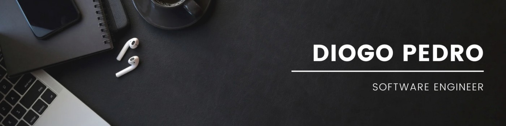

# Hello World!, I'm Diogo Pedro 👋🏼

👨🏼‍🎓 Currently pursuing my Master's in Computer Engineering at the Faculty of Science  
🖥 Passionate about computer networking and cybersecurity  
⌛️ Fun fact about me is that I'm very interested in speedcubing.  
💡 Thrive on learning new things and always looking for new challenges  
💻 Currently the President of the Fiscal Council at [APS - Associação Portuguesa de Speedcubing](https://speedcubingportugal.pt/home) and also maintain its website   

# Tech stack:

  
  
  
  
  
  
  
  
  
  
  
  
  
  
  
  
  
  
  
  
  
  
  
  
  
  
  
  
  
  
  

  

# Stats and Socials:

 

###

    
  

###

 

###

  
  
  

###
